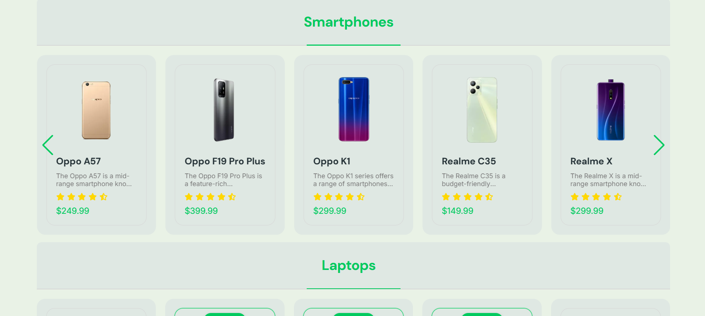
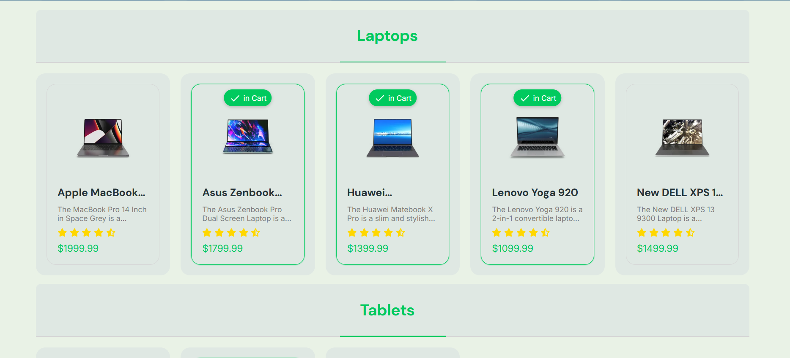
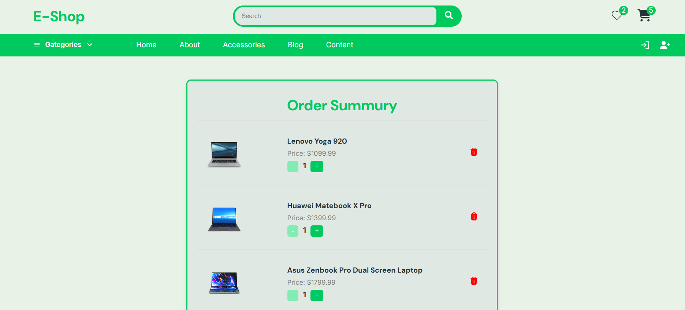
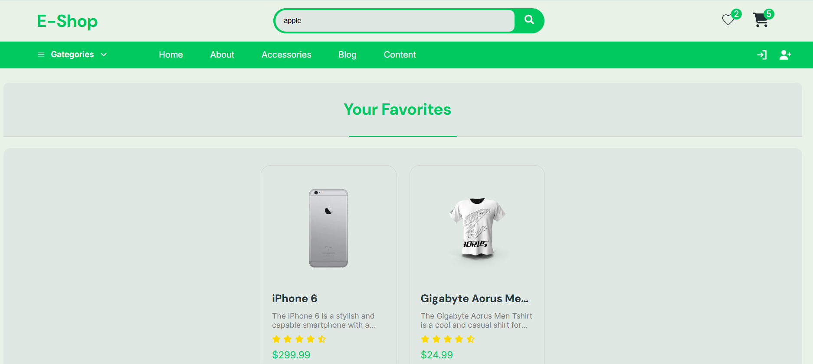

# E-Commerce Web Application

A modern E-Commerce web application built using React and Vite.

## 🚀 Features

- Browse products
- Modern and clean UI
- View product details
- Shopping Cart page (Add / Remove products)
- Favorites page (Add / Remove from wishlist)
- Real-time product search functionality
- Smart alert notifications when adding or removing products
- Fully responsive design (Mobile & Desktop)

## 🛠 Tech Stack

- React
- Vite
- React Router
- Framer Motion
- Swiper

## 📦 Installation

1. Clone the repository

git clone https://github.com/Umar1082003/E-commerce.git

2. Install dependencies

npm install

3. Run the project

npm run dev

## 🌍 Live Demo

https://umar1082003.github.io/E-commerce/

## 📸 Screenshots

### 🏠 Home Page

### 🛒 Cart Page

### ❤️ Favorites Page

